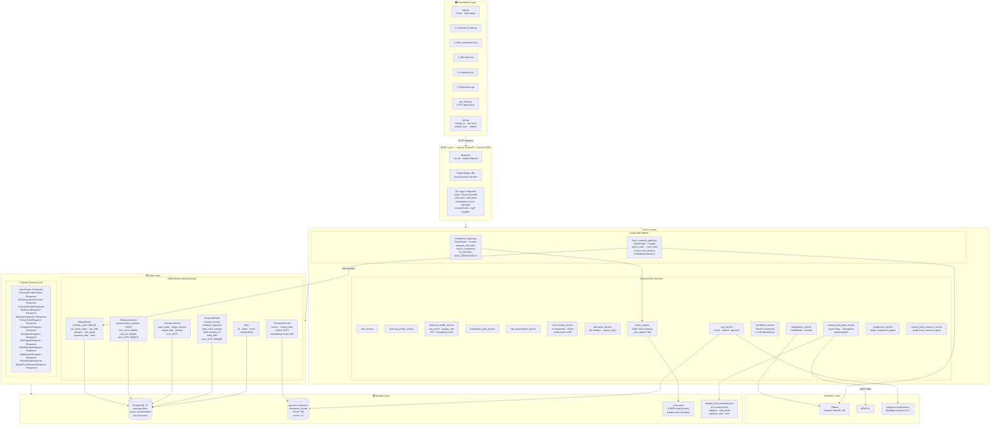

# Architecture Diagram — Agentic Wealth Management Copilot

> **Technical internals**: every layer, file, service, agent, and data model
> — and how they wire together at the code level.

---
LINKS: https://mermaid.live/view#pako:eNqdV81u40YSfpUGgQSeZCRbf5ZsJAFoSfYokcaKKQfZjRZEi2xLHZNNprspS5kMkEOQaw4ZJNi97Gl3HyF73keZF9h9hK1qUhJp0sEgPtju7qrq6qqvviq-srzIZ9a5dRdED96KSk1mg7mYCwI_KlksJY1XZDomX82t__39l3_8998_ETKVTDGhqeaRIGO6ZXJu_SVVwR97OgVpGsf1eDufixdRyMh_fiO3ikmimE7igvT0qgHSDfeSCyo8TgN3KqM7HjDULgo2QbDp3nB179pKMaVC8KIs1gKxlmsHQeQZF8sSbZBouw4Pk-AJiQ5IdNzhJg6oqBSx--aN3PUCnnkBT53NpoQulJbUQ6WCxu0MNBLNA5UK30UypNrlQmJ0Ys6IiT-cSPZNwiVzE4wYnCnuswU9BJkJv5Qi26To7d_-ajJkT0dpYgh5-_0bQkLK8QWEHF1SpfH0Q3K75l4kBbGdq9GzgqfjSzAV8DumYiqOnoFHXHDt-gt0hoklF6zucxVHihX0BiPQG7AY_FNHS4YaqGyrrfAcSBfChYuvWTk2Q0RM8-RDQlEWHxhHXGgF2scYBUXI8d0OILU4BQgeSgBDTcE7GEjQfcrxyIvCOOCgwmreinn3IKDSjBvNMNEJ2LpLwFk4knR5_AH8ZZhyLn431k5WDm_-RYjDJMSRVZSBDyn00hK52ZkomBkMZ8QETDMZQoSV5t7OniqYwh8HywRj4apUpCyB9bGPkptF6WnxVkF8xWigV3vpuRCQwIdI6pWBIF1zsVSuTKM3mI0MFkIml0x4WxfDWL4B64yLNVMaK9VdRnDPk-5gyWE6Xbqv7aeFT3fCmHvwLOd3u4aZjwToo4-Nk5NajFX1ILlmiiwoQEFHZHBRttrFmt6DKGdTcyilIIrukxgqx8X61FvXo_HRs7KVHlhJ0WXC4vpU05ytFOIrreMN-uewEMAAAIajJAYxTWKqARKibPkMLMdRwCHgaRmCzp_syRhcoz6hmigNDAIEOxeuTCD3QMJAT4oAEPQjeKaYOgGLas-DOS9fJuF0S9aAYIivYj4CAoNGfFPfmPQKc4hRqKScHW-ViPsUKwvmG6ZbplYr1BHA7MC5OTP9FdXXQUBDiiagQNfRfQUsGojpQ-HnDDxAySmSO6IAXF1hof0oe9jrqPRWJVvF07K5HHMUmfoKq35MxfIqXaNmud7tRvEp5oK0czjQelmqDMFoEQEtHKkSpRMNonkeNNznHgxh5-GboszE_tIdzYY39mx0_dL5uFN2xlBL-cFV_jT3_hgRF1fk7Y9voOiiwKzgqJUxPe4RL4hUIo1KLs_md6veKAf1KV4eZLz88z-hF0HRVZDyXnZyPRiOHZS_vpmQCXgVQBs4cj4f2wGELNyWC3uCGcEpBhuigbKg6WgDJcwD07jTOlIrHpczOsEg7sec6b6JUSEQbRzzh-swEnoVQIlvoNKUCYuONEh4VAEMUybeb7INNg5gQKiJ_SbMC0h5pl2Aq5efkduXo89vh2WfsGBGe4q-AoYGPUPUu8cBpWAvp2GUCDSarYHVzHEsOTCE3hauK9-DZYWT22FwA4VvErgX4iUojjtUqAds9Z861y8xmDt6Z0QkAIaFCZbZNXSc23yHd2J3mZiyvsRWNRcKs8xcHH93SmnPw_aj3TUNEpbmeG3eiqUEf5aR3OK28QOgZNCcZQq7I48MQSVh2QXsWYPIS_DxfaRF9CJKpGfuMUQJSfTZxpSy0NjAZsMvZ3gBkqcPWSZfGO4krV77ncjG6b8YTmyD8-nWp8KMGPhyimhfNyvaV_9FBvO-ZJjjY3IDgyCAGl_6GL5VMsU0_66VF2boeKTrYM5vmAFHUe8w01ceT01r7CPhVZ739yRYeXz4Hqg8vrGvRmIJ20-d3jAtOVtXG899SlSeH7D51Kah3Qrdd6fHi5Qef_3BfCM4gCNg6AqSnF59dQR4iZReSgaMSBrd3dwSL4kv-dpwoNlwVTrYh_TebOaH_bn1rGD1CzS7a_-EbQDhKm1AflYWrqkCJLcczrEaFAw75KOPPymaxNkHJw4YdVR9S0Pkrh5xhhejGhcqBlLxiTmEfRyRYBlB9vOTUv7dk-HMftT9Q6Ypzm_1r5VxtHFCvASHYN_0f_WHWaEqQVDrmKHhBqc_GkCSxwD3oODj9RhfnLZIfFXWJMmuXTbPW4vioy7hcw_JD__WeXGqdPCbFL_lGX4mwWerUPhZCiwMti9se3S8WLKaCmFaqDFRWzfqnaoXvPceGfpQGulqOia12iffzS3zOSxTxEI7_A4-UlMJ20jAd1S6dNLlIFsOsuXFzrxzZjYw29lGz2xgvvIbcGVuuMYLzaN3ZuxGeutZtmxmOsUZBLU6eQkMeXZLo7SRmZwV1wD13aWT08NOOkSQ92ESwF8t_NXGX51MxnpuLSX3rXMtE_bcgjzAYAFL6xUqg6fYsubWOfzrszuaBDBxzsVrUIMP9T9HUbjTlFGyXFnndzRQsEpibGADTgFmBxGc4mUfm7p13mj1jA3r_JW1sc6b7W6912i2W91Ot9tsn_baz60tSDU79UYb9pqN1lnntH3Wff3c-tZce1I_7Tbhp9c7bZ92G52T3uv_A-XHIE4
https://mermaid.live/view#pako:eNqNVt1u48YVfpUBFwG8WMsmRdGihSSALMteA_JakbRFfhQYo-FIGpicYYakYu0PkIuiKIogaZOgQXKTYJHkqkCviva6j7IvkDxCz5khZdFaFNENNeQ53znznW_OmecOUxF3Os48Vp-yJdU5mZxOJYHf072Pps5vP_ztJ3IhI0ElGfGcihhWK57lSk-djx9OpbXNitlC03RJzvrEeP3951__8yUh41xzmsQiJ2dayZzLiJDXn70iJFaMxkuV5Z0wcD2Asjj4i4TmLBdKksHo7u3QNbhf_kgeq4RPp7IHyDknh2SgaESeZlzXUIaesf_6L-RMSCqZoDEZajUXMTpfSAYo5L__JmO6EnKR4d9TPsvrGE2D8cU_yUhkN6SbZTzLEi5zQHivABIgSUkhXfKIjJnSvO7t2wz-TLoxbhetMW-VpDHQyTjpLhCr5tMyPt-8ImORFHHlc4nckR7VsSLjiyFJYyrl_Q0HxvWrf5D-LX6vfK_imCYUXYRs9OUiFtmy7uiSRuNdIMw-mvbh20fLPgJrDvXbqfiJqfjr778zBT-jWd4dXpATym7eWG3XdcuXTfcRodlaMoRNlZB5ZvK6y2wTY_R00B9bYf3wCuqUc50IKaAAjMCWhOSE7I2KmGfwkYmIP6ztEH9nj8H9TgqPOY3zJdAzXNKME3_HfjQGe1N2rCxIZGPbQq20GiCgVEkoIC49122k-Q5Itw8gd9Uvc90gBeg6EVwDQeqmSEFGS4j1DCwZTXfQhog2VLFg6_tIISJ90L0c4DMk4_7JRUPILAVtRkQjMTtolz1A2xLWBstzEeRJkQzX5dbc1599HWDhMsYl1ULV0bZUUata99yW7Jt_WaVDsQZ0DbslewMqF-dotFuoXhecdg5JldwxpuQTCU3LnNmopgWgMQVTqchgcLkrgRFCnxUgyxHPONVseQ-9jZC9Jc3LQ2NiWY3mSsWExSorNJA5lRCAsKVS0BLMt99Hyah7Pih1_CMuLCE7mV48OcdSX40n5FDTxSHID7oNRGXLQt6Q13_6ivBkBqXFf-liBf1S7aKM-pMaiua5FnyFqvmk4Hp9D4epDA-SJeb_7ab__hBwt7oMOefQjSjmsBFRE8kDwEXMtxmFPhBjhagGe6AOT1GRQwYrriPBai3gTd1mPLkalSPm2z-ajjOEtrLQfPzegHhtkJYpV7qAs1QRU9fY6Yn30R4qDNr2hM5iU80Cxgc-51WDuE7trMCXwgw87PvXC0VjfKWhMVzTzTyArB_WQjQxRFLkBSDNQXDok7ElT_g1zlvkRtIVPqAz8IXS6woUtmm_89uUy4xfa6T4Pr6P-JFihcnKqAJD-GGrEYmE2H0DuXGR4AyomKhq_PY7794hvonmwVWvWwoVJu4A2zcZc70SDGpG9p5xrfAwFBEi5nWCrwbG75fviK05xDdP_8AjRmgEGSG6PIJ3n5sdf1Za8K0Rto3dv6zmY8bxOsF4I9dUZnOlE1vBk2734nC24I0sAak1uGysvINgixugNqbP1o0Yrg082qBvsdB_f2KifP5XcnkGw-xAIIcDseLkSfcPJKI57sm2hWWep7ekHGRCHYx5AvxVVwGL99Zb5npC8IpVXq1wqr6YOjOtPsUvkFOq4Opl70Iv4BZl7eA2ZQ0fTyZDYOwTvHTgLmkqrlksgIODdI0eJ_2taNXwRSrHUHa64PabnaM40eEU7L5q2le9bt0E-maZxunJTh8c9wf93oTUtA75bMCglZVofhmwPynRSjFG0LtNpzeqfGEt37gXo8NaTiC2qmbD2roK27-sRTXrDXb_FoaHBGlj8ezbk4px2zbtthpmW4fGChIEfWyEUloXKZQxN_J4RBK4JxuRVDxsAo7zdYxXCXvYYMFL_qHVxJ0HPJwH_Hg_y7W64Z0Hfhhyn-3DKVa688CbBbzpbrvC-CCVpz9vzqONp3fcPoqalacbtdrUqwXFMWQ95_O5z92N5zxoM9etPPlRAON_29M2htLV58E82Li2Z96cboK2qNcK2bYrslV5Mt7ibOPJjpphM6w8Z22PeczZdxZaRE4n1wXfd-B0JxSXznPEnDo5NtOp04G_EZ_TIobb11S-BLeUyg-VSipPrYrF0unMoXHDqkihMvxUUOhzdyYgMK57qpC502n5LYPhdJ47t06nCX3pOGiHR67bdNuuFwT7ztrpNPyjg-DYbfmeFx4fe-2W_3LfeWbCugfHXuC2ms0wDIPQC4-8l_8DDJlbcg 
## Mermaid Diagram



---

## ASCII Fallback — Layer-by-Layer

```
═══════════════════════════════════════════════════════════════════════════
                        PRESENTATION LAYER (Streamlit)
═══════════════════════════════════════════════════════════════════════════

  frontend/
  ├── app.py                 ← Home, user create/load, session_state seed
  ├── api_client.py          ← All HTTP calls to FastAPI (requests lib)
  ├── utils.py               ← format_inr(), require_user(), pie chart, sidebar
  └── pages/
      ├── 1_Financial_Profile.py   reads session_state[user_id]
      ├── 2_Risk_Assessment.py     writes session_state[risk_tier, risk_score]
      ├── 3_Allocation.py          writes session_state[equity_pct, debt_pct, gold_pct]
      ├── 4_Simulation.py          writes session_state[simulation_result]
      └── 5_Explanation.py         reads all session_state, calls /explain

═══════════════════════════════════════════════════════════════════════════
                             API LAYER (FastAPI)
═══════════════════════════════════════════════════════════════════════════

  backend/app/main.py
  ├── @asynccontextmanager lifespan()  → await init_db() on startup
  ├── app = FastAPI(lifespan=lifespan)
  ├── Depends(get_db) → AsyncSession injected per request
  └── 20+ async endpoints:

      Phase 1-2  │ /users  /financial-profile  /investment-goals  /risk-assessment
      Phase 3    │ GET  /financial-health/{user_id}
      Phase 4    │ POST /risk-score
      Phase 5    │ POST /allocation
      Phase 6    │ POST /mutual-funds/sync    GET /mutual-funds   GET /mutual-funds/{code}
      Phase 7    │ POST /mutual-fund-research
      Phase 8    │ POST /policy-check                    ← no DB dependency, stateless
      Phase 9    │ POST /compliance-check
      Phase 10   │ POST /simulate                        ← no DB dependency, pure NumPy
      Phase 11   │ POST /rag/ingest   POST /rag/retrieve
      Phase 12   │ POST /explain                         ← no DB dependency, pure Ollama

═══════════════════════════════════════════════════════════════════════════
                           SERVICE LAYER (Business Logic)
═══════════════════════════════════════════════════════════════════════════

  DETERMINISTIC SERVICES:
  ┌─────────────────────┬──────────────────────────────────────────────────┐
  │ user_service        │ create_user · get_users · get_user_by_id         │
  │ financial_profile.. │ create · get_all · get_by_user_id                │
  │ financial_health..  │ compute_financial_health()                       │
  │                     │   → net_worth · monthly_surplus · savings_rate   │
  │                     │   → DTI · emergency_fund_months + status labels  │
  │ risk_assessment..   │ create_risk_assessment · get_by_user_id          │
  │ risk_scoring..      │ compute_risk_score()                             │
  │                     │   → _age_score + _horizon_score + _income_score  │
  │                     │   + _questionnaire_score → tier → WRITES TO DB   │
  │ allocation..        │ compute_allocation()                             │
  │                     │   → _TIER_ALLOCATIONS lookup → _equity_cap()     │
  │ mutual_fund_data..  │ sync_mutual_funds()                              │
  │                     │   → httpx.AsyncClient + asyncio.Semaphore(10)    │
  │                     │   → asyncio.gather(10 concurrent fetches)        │
  │                     │   → upsert pattern (SELECT IN → update/add)      │
  │ policy_engine       │ check_policy()                                   │
  │                     │   → loads rules.yaml ONCE at import              │
  │                     │   → _rule_applies() filter (tier + horizon)      │
  │                     │   → max/min breach evaluation                    │
  │ simulation..        │ run_simulation()                                 │
  │                     │   → np.random.normal (n, months) matrix          │
  │                     │   → weighted portfolio returns                   │
  │                     │   → monthly compounding loop (vectorised)        │
  │                     │   → success_probability + p10/p25/p50/p75/p90    │
  │ rag..               │ ingest_document() + retrieve_chunks()            │
  │                     │   → _chunk_text() sliding window                 │
  │                     │   → _embed() lazy-loaded SentenceTransformer     │
  │                     │   → pgvector cosine <=> operator                 │
  │ explanation..       │ generate_explanation()                           │
  │                     │   → _build_user_prompt() structured → text       │
  │                     │   → await ChatOllama.ainvoke([Sys, Human])       │
  └─────────────────────┴──────────────────────────────────────────────────┘

  LANGGRAPH AGENTS:
  ┌─────────────────────────────────────────────────────────────────────────┐
  │ compliance_agent.py                    fund_research_agent.py           │
  │                                                                         │
  │ State: ComplianceState (TypedDict)     State: AgentState                │
  │   user_id · goal_horizon_years           messages: List[BaseMessage]    │
  │   equity/debt/gold pct                   Annotated[..., operator.add]  │
  │   risk_tier · violations []                                             │
  │   iteration · passed                   Nodes:                          │
  │                                          agent_node (ChatOllama)       │
  │ Nodes:                                   tool_node (ToolNode)          │
  │   compute_allocation_node (async)                                       │
  │     reads DB → risk_tier               Tools (closures over db):       │
  │     applies tier lookup + horizon cap    search_funds_by_category()    │
  │   check_compliance_node (sync)           search_funds_by_risk_grade()  │
  │     calls check_policy()                 get_fund_details()            │
  │   fix_allocation_node (sync)                                            │
  │     max violations → trim → debt       Router:                         │
  │     min violations → top up from eq      should_continue()             │
  │                                          tool_calls? → tools           │
  │ Router:                                  else → END                    │
  │   passed OR iter≥5 → END                                               │
  │   else → fix                           Model: llama3.1 via Ollama      │
  │                                        bind_tools() → JSON schema      │
  │ MAX_ITERATIONS = 5                                                      │
  └─────────────────────────────────────────────────────────────────────────┘

═══════════════════════════════════════════════════════════════════════════
                             DATA LAYER (ORM + Schemas)
═══════════════════════════════════════════════════════════════════════════

  ORM MODELS (backend/app/models/):

  User  ──(1:1)──  FinancialProfile     (user_id FK UNIQUE · Float fields)
    │   ──(1:1)──  RiskAssessment       (user_id FK UNIQUE · JSON + nullable score/tier)
    └───(1:N)───   InvestmentGoal       (user_id FK · goal_name · target_amount · Date)

  MutualFund                            (scheme_code UNIQUE · nav · category · risk_grade)
  DocumentChunk                         (source · chunk_index · content · Vector(384))

  All tables:  DateTime(timezone=True) · default=func.now() · onupdate=func.now()
  All models imported in models/__init__.py  →  discovered by Base.metadata.create_all

  PYDANTIC SCHEMAS (backend/app/schemas/):
  Request schemas  →  Pydantic validation at HTTP boundary
  Response schemas →  from_attributes=True  →  read from ORM objects
  No business logic in schemas. Business logic lives in services only.

═══════════════════════════════════════════════════════════════════════════
                           STORAGE LAYER (PostgreSQL)
═══════════════════════════════════════════════════════════════════════════

  backend/app/db/database.py:

  postgresql://... → replace → postgresql+asyncpg://...
  create_async_engine(_async_url, echo=False)
  async_sessionmaker(engine, expire_on_commit=False)

  async def get_db() → AsyncGenerator[AsyncSession, None]:
      async with AsyncSessionLocal() as session:
          yield session          ← one session per request, auto-closed

  backend/app/db/init_db.py:

  async with engine.begin() as conn:
      await conn.execute(text("CREATE EXTENSION IF NOT EXISTS vector"))
      await conn.run_sync(Base.metadata.create_all)     ← idempotent

  Tables:
  ┌──────────────────────┬──────────────────────────────────────────────┐
  │ users                │ id · name · email (UNIQUE)                   │
  │ financial_profiles   │ id · user_id (FK UNIQUE) · 5 float fields    │
  │ investment_goals     │ id · user_id (FK) · goal fields              │
  │ risk_assessments     │ id · user_id (FK UNIQUE) · JSON · score/tier │
  │ mutual_funds         │ id · scheme_code (UNIQUE) · nav · metadata   │
  │ document_chunks      │ id · source · chunk_index · content · vector │
  └──────────────────────┴──────────────────────────────────────────────┘

  Static files (not in DB):
  ├── backend/app/data/mutual_fund_metadata.json   ← 10 curated funds
  └── backend/app/policies/rules.yaml              ← 8 SEBI-inspired rules

═══════════════════════════════════════════════════════════════════════════
                              FULL CALL CHAIN EXAMPLE
                         POST /compliance-check  {user_id:1, horizon:7}
═══════════════════════════════════════════════════════════════════════════

  Streamlit page 3
    → api_client.run_compliance_check(1, 7)
    → POST /compliance-check
    → FastAPI injects AsyncSession via Depends(get_db)
    → run_compliance_agent(db, ComplianceRequest)
        → create_compliance_agent(db)  [factory: db captured in node closures]
        → agent.ainvoke(initial_state)
            │
            ▼ compute_allocation_node (async)
              SELECT risk_assessments WHERE user_id=1  →  risk_tier="Safer"
              _TIER_ALLOCATIONS["Safer"] = {equity:40, debt:55, gold:5}
              _equity_cap(7) = None  →  no cap
              returns {equity:40, debt:55, gold:5, risk_tier:"Safer"}
            │
            ▼ check_compliance_node (sync)
              check_policy(PolicyCheckRequest(equity=40, debt=55, gold=5, tier="Safer", horizon=7))
              safer_equity_cap: 40 > 55? → NO
              global_debt_floor: 55 < 5? → NO
              global_gold_floor: 5 < 3? → NO
              total: 40+55+5=100 → OK
              returns {violations:[], passed:True, iteration:1}
            │
            ▼ route_after_check: passed=True → "done" → END
        │
        final state → ComplianceResponse
    → Streamlit: session_state[equity_pct]=40, [debt_pct]=55, [gold_pct]=5
    → matplotlib pie chart rendered
```

---

## Dependency Graph

```
                              main.py
                                │
          ┌─────────────────────┼──────────────────────┐
          │                     │                      │
     user_service    financial_health_service    risk_scoring_service
          │                     │                      │
financial_profile_service    financial_profile_service  risk_assessment_service
          │
     [database.py → AsyncSession]
          │
     [models/ → User, FinancialProfile, ...]
          │
     [PostgreSQL via asyncpg]


compliance_service → compliance_agent → [policy_engine + database]
fund_research_service → fund_research_agent → [Ollama + database]
rag_service → [sentence-transformers + pgvector]
explanation_service → [Ollama]
```

---

## Technology Decisions at a Glance

| Component           | Technology                                | Why                                                            |
|---------------------|-------------------------------------------|----------------------------------------------------------------|
| Web framework       | FastAPI + Uvicorn                         | ASGI native, auto OpenAPI, type-driven                         |
| DB driver           | asyncpg                                   | Non-blocking, fastest async Postgres driver                    |
| ORM                 | SQLAlchemy 2.0 async                      | Mature, type-safe, async-first                                 |
| Validation          | Pydantic v2                               | model_dump(), from_attributes, fast                            |
| Agent orchestration | LangGraph                                 | Explicit state machine, debuggable loops                       |
| LLM runtime         | Ollama                                    | Zero cost, local, no API keys                                  |
| LLM models          | llama3.1 (agents) / llama3.2:3b (explain) | Right model for right task                                     |
| Vector store        | pgvector (in PostgreSQL)                  | No separate infra; SQL + vectors in one place                  |
| Embedding model     | BAAI/bge-small-en-v1.5                    | 384-dim, local, quality sufficient for financial text          |
| HTTP client         | httpx (async)                             | Async-native, compatible with asyncio.gather                   |
| Simulation          | NumPy                                     | Vectorised matrix ops, 1000 scenarios in <50ms                 |
| Frontend            | Streamlit                                 | Pure Python, no HTML/JS, PyCharm-compatible                    |
| Containerisation    | Docker + Compose                          | Reproducible PostgreSQL, one-command startup                   |
| Rules format        | YAML                                      | Human-readable by non-developers, no code changes to add rules |
