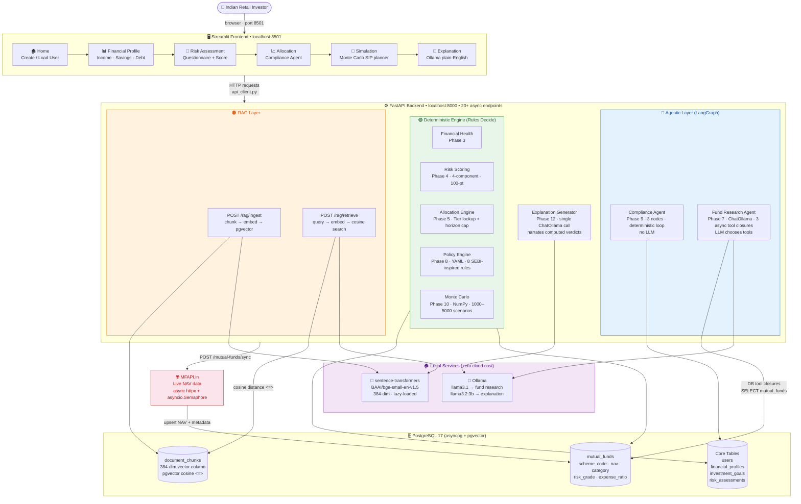

# System Design — Agentic Wealth Management Copilot

> **High-level view**: how the user experiences the system end-to-end,
> what each layer is responsible for, and where external services plug in.

---

## Mermaid Diagram



---

## ASCII Fallback

```
┌────────────────────────────────────────────────────────────────────────────┐
│                      AGENTIC WEALTH MANAGEMENT COPILOT                     │
│                        "LLM explains, rules decide"                        │
└────────────────────────────────────────────────────────────────────────────┘

  👤 Indian Retail Investor
         │
         │  browser  localhost:8501
         ▼
┌──────────────────────────────────────────────────────────────────┐
│  STREAMLIT FRONTEND                                              │
│                                                                  │
│  [🏠 Home] → [📊 Financial] → [🎯 Risk] → [📈 Alloc] → [🔢 Sim] → [💬 Explain]  │
│   Create         Profile        Assessment  Compliance  Monte      Ollama    │
│   / Load User    + Health       + Score     Agent       Carlo      Narration │
└──────────────────────────────────────────────────────────────────┘
         │
         │  HTTP  api_client.py  localhost:8000
         ▼
┌──────────────────────────────────────────────────────────────────┐
│  FASTAPI BACKEND  (Uvicorn ASGI · 20+ async endpoints)           │
│                                                                  │
│  ┌────────────────────────────────────┐                          │
│  │  🟢 DETERMINISTIC ENGINE           │   Rules decide.          │
│  │  Financial Health  Phase 3         │   All computations are   │
│  │  Risk Scoring      Phase 4         │   pure math + lookup     │
│  │  Allocation        Phase 5         │   tables + YAML rules.   │
│  │  Policy Engine     Phase 8         │   No LLM involvement.    │
│  │  Monte Carlo       Phase 10        │                          │
│  └────────────────────────────────────┘                          │
│                                                                  │
│  ┌────────────────────────────────────┐                          │
│  │  🔵 AGENTIC LAYER  (LangGraph)     │                          │
│  │                                    │                          │
│  │  Compliance Agent  Phase 9         │   3-node StateGraph.     │
│  │  compute→check→fix→converge        │   No LLM. Deterministic  │
│  │                                    │   violation repair loop. │
│  │  Fund Research Agent  Phase 7      │   ChatOllama + 3 async   │
│  │  agent↔tools loop                  │   DB tool closures.      │
│  └────────────────────────────────────┘                          │
│                                                                  │
│  ┌────────────────────────────────────┐                          │
│  │  🟠 RAG LAYER  Phase 11            │   LLM explains.          │
│  │  /rag/ingest  /rag/retrieve        │   Chunk → embed →        │
│  │                                    │   pgvector cosine <=>    │
│  └────────────────────────────────────┘                          │
│                                                                  │
│  🟣 Explanation Generator  Phase 12  single ChatOllama call      │
└──────────────────────────────────────────────────────────────────┘
         │                         │                        │
         ▼                         ▼                        ▼
┌──────────────────┐    ┌─────────────────┐    ┌────────────────────┐
│ PostgreSQL 17    │    │ 🦙 Ollama (local)│    │  🌐 MFAPI.in       │
│ + pgvector       │    │                 │    │  Live NAV Data     │
│                  │    │ llama3.1        │    │  async httpx       │
│ users            │    │ (fund research) │    │  asyncio.Semaphore │
│ financial_...    │    │                 │    │  10 curated funds  │
│ risk_assess...   │    │ llama3.2:3b     │    │                    │
│ mutual_funds     │    │ (explanation)   │    └────────────────────┘
│ document_chunks  │    └─────────────────┘
│ (384-dim vecs)   │
│ asyncpg driver   │    ┌─────────────────────────────┐
└──────────────────┘    │ 🔢 sentence-transformers     │
                        │ BAAI/bge-small-en-v1.5       │
                        │ 384-dim · locally run        │
                        │ lazy-loaded on first use     │
                        └─────────────────────────────┘
```

---

## Phase → Responsibility Mapping

| Phase  | Component                         | Responsible For                              | LLM?    |
|--------|-----------------------------------|----------------------------------------------|---------|
| 1      | FastAPI + Docker + SQLAlchemy     | Infrastructure scaffold                      | No      |
| 2      | ORM models + CRUD services        | Data persistence layer                       | No      |
| 3      | `financial_health_service`        | Net worth, savings rate, DTI, emergency fund | No      |
| 4      | `risk_scoring_service`            | 4-component risk score → tier                | No      |
| 5      | `allocation_service`              | Tier lookup + horizon cap                    | No      |
| 6      | `mutual_fund_data_service`        | async httpx sync from MFAPI.in               | No      |
| 7      | `fund_research_agent` (LangGraph) | LLM picks funds from DB via tools            | **Yes** |
| 8      | `policy_engine`                   | YAML rule evaluation                         | No      |
| Pre-9  | Async DB migration                | psycopg2 → asyncpg                           | No      |
| 9      | `compliance_agent` (LangGraph)    | Deterministic compute→check→fix loop         | No      |
| 10     | `simulation_service`              | NumPy Monte Carlo, success probability       | No      |
| 11     | `rag_service` + pgvector          | Document chunk ingestion + retrieval         | No      |
| 12     | `explanation_service`             | Narrate verdicts in plain English            | **Yes** |
| 13     | Streamlit frontend                | 5-page UI, session state, api_client         | No      |

**LLM is used in exactly 2 of 14 components** — and in both cases it only narrates or retrieves, never decides.

---

## Key Design Decisions

| Decision        | Choice                     | Rationale                                                                      |
|-----------------|----------------------------|--------------------------------------------------------------------------------|
| LLM role        | Narration + retrieval only | "LLM explains, rules decide" — financial decisions must be auditable           |
| Database        | PostgreSQL + pgvector      | Single infrastructure component handles both structured data and vector search |
| LLM runtime     | Ollama (local)             | Zero API cost, data privacy, no rate limits                                    |
| Async driver    | asyncpg (not psycopg2)     | Non-blocking I/O across the full ASGI stack                                    |
| Agent loop      | LangGraph StateGraph       | Explicit state machine for predictable, debuggable agent behaviour             |
| Embedding model | BAAI/bge-small-en-v1.5     | 384-dim — fast local inference, sufficient quality for financial text          |
| Rules storage   | YAML (not Python)          | Financial rules readable by compliance team without code changes               |
